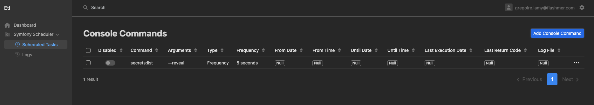
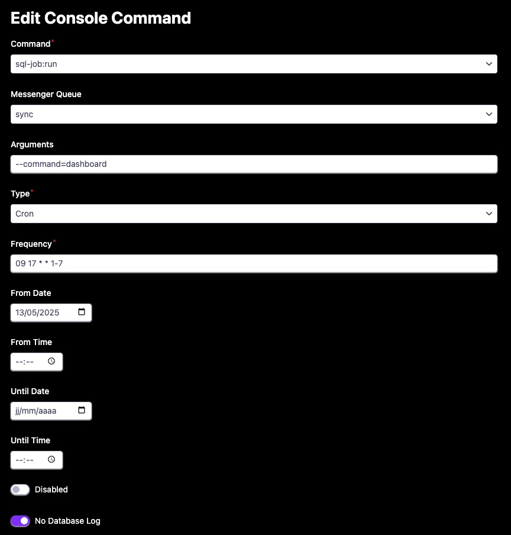
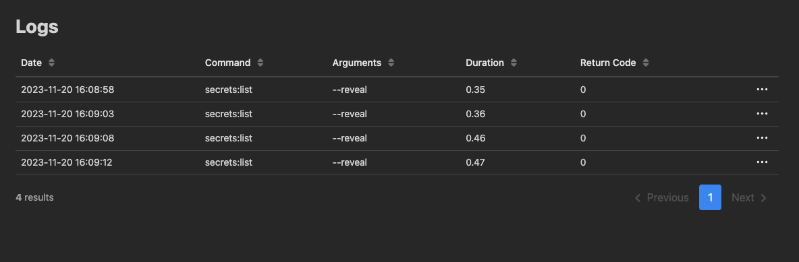

Copyright (c) 2023 Greg LAMY <greg@bytespin.net>

This is a public project hosted on GitHub : https://github.com/ByteSpin/ConsoleCommandSchedulerBundle.git

This bundle was originally developed as part of an ETL project.

ByteSpin/ConsoleCommandSchedulerBundle is a Symfony 6.3 simple bundle that allows you to schedule console commands easily:
- Use the latest messenger/scheduler Symfony 6.3+ components,
- Log all console commands data (last execution time, duration, return code) in database and log file,
- An admin interface is available with the help of EasyCorp/EasyAdmin bundle
- Specific events are available for deeper integration with your application and/or notification system

> [!NOTE]
>
> This project is still at alpha state and has not yet been fully tested outside its parent project.
>
> **Feel free to submit bug and/or pull requests!**
>
> You can check the [CHANGELOG](CHANGELOG) to see the latest improvements and fixes.

Just keep in mind that I want to keep it as simple as possible!

> [!IMPORTANT]
>
> Version 1.0.9 requires schema update.
> Please run : 
> ```php php bin/console doctrine:schema:update --force```


Requirements
------------
- php 8.2+
- Symfony 6.3+

Installation
------------

1. First install the bundle:
```bash
composer require bytespin/console-commande-scheduler-bundle
```

2. Then update the database schema:
```bash
php bin/console doctrine:schema:update --force
```

Updating the bundle
-------------------

For now, the bundle still lacks a custom recipe to manage database schema upgrade when needed.

**Do not forget to update the database schema when updating the bundle**

The last version that includes schema modifications is : 1.0.9


Manual bundle registration
--------------------------

You will need to manually register the bundle in your application.

To do this, follow these steps:

1. Open the file `config/bundles.php` in your Symfony application.

2. Add the following line to the array returned by this file:

    ```php
    ByteSpin\ConsoleCommandSchedulerBundle\ConsoleCommandSchedulerBundle::class => ['all' => true],
    ```
   
3. Save the file. Your bundle is now registered and ready to be used in your application.

Make sure to perform this step after you have installed the bundle using Composer, but before you use any of its features in your application.

Configuration
-------------

You will have to configure the entity manager to be used with the ByteSpin\ConsoleCommandSchedulerBundle entities.
This has to be done once after installation.
We provide a script to automatise this step ; please run :
```shell
bin/console bytespin:configure-console-command-scheduler
```

If you prefer to do this by yourself, add the following lines just within your entity manager 'mappings:' key in doctrine.yaml :

```yaml
# src/config/packages/doctrine.yaml
doctrine:
    dbal:
    (...)
    orm:
    (...)
        entity_managers:
            your_entity_manager:
            (...)
                mappings:
                  ByteSpin\ConsoleCommandSchedulerBundle:
                  is_bundle: false
                  type: attribute
                  dir: '%kernel.project_dir%/vendor/bytespin/console-command-scheduler-bundle/src/Entity'
                  prefix: ByteSpin\ConsoleCommandSchedulerBundle\Entity
                  alias: ByteSpin\ConsoleCommandSchedulerBundle
            
    

```

> [!IMPORTANT]
>
> If your project contains entities mapped to multiple entity managers, be careful to not use the auto_mapping: true in your doctrine configuration.
>
> This would prevent the getManagerForClass() function used in the bundle to get the correct entity manager to work properly!
>
> In such case :
> - Choose the correct entity manager when you run the configuration script,
> - Be sure to remove the 'auto_mapping: true' key from your doctrine.yaml (or set it to false),
> - Be sure that ALL your entities are correctly mapped in the 'mappings:' sections of your doctrine.yaml


Administration interface
------------------------

> [!NOTE]
>
> Please note that the administration interface is based on EasyAdmin symfony bundle.
> 
> Because you might already use EasyAdmin in your project, no DashboardController is provided with the bundle.
> 
> If you don't have one, generate it with ```bin/console make:admin:dashboard```

You need to manually add the menu to your DashboardController.php file, for example:

```php
use ByteSpin\ConsoleCommandSchedulerBundle\Entity\Scheduler;
use ByteSpin\ConsoleCommandSchedulerBundle\Entity\SchedulerLog;
use ByteSpin\ConsoleCommandSchedulerBundle\Controller\Admin\SchedulerCrudController;
use ByteSpin\ConsoleCommandSchedulerBundle\Controller\Admin\SchedulerLogCrudController;

(...)

yield MenuItem::subMenu('Symfony Scheduler', 'fa-duotone fa-folder-gear')->setSubItems([
    MenuItem::linkToCrud('Scheduled Tasks', 'fa-light fa-clock', Scheduler::class)->setController(SchedulerCrudController::class),
    MenuItem::linkToCrud('Logs', 'fa-duotone fa-clock-rotate-left', SchedulerLog::class)->setController(SchedulerLogCrudController::class),
]);
```
(The previous lines make use of FontAwesome icons. You are free to use any other solution)

Usage
-----
> [!NOTE]
> The bundle makes use of the very new symfony/scheduler component that is said to be experimental on 6.3 symfony version
> 
> That will change in the forthcoming 6.4 release. 
> 
> The only documentation available for the moment is on the official symfony blog, with some useful examples.
> Please read it carefully at https://symfony.com/blog/new-in-symfony-6-3-scheduler-component
> 
> The 'from_date', 'from_time', 'until_date', 'until_time' bundle parameters are used to construct the expected scheduler trigger

The administration interface provides two sections:

- **<u>The main console command scheduler section:</u>**

    - When you click on the menu, EasyAdmin provides the default list view for Console Commands  Scheduler
      

    - You can add/view/edit any entry in this list:
      
      
      - **Disabled**: if checked, the Console Command will be ignored by the scheduler 
      - **Command**: this field lists all available console commands defined in your symfony project
      - **Arguments**: provide any console command arguments if needed, separated by a space, as if you were typing them on the command line
      - **Type**: here you select one of the two symfony/scheduler supported command type 
        - 'Frequency' will generate a trigger of the RecurringMessage::every form,
        - 'Cron' = will generate a trigger of the RecurringMessage::cron form
      - **Frequency**: here you type the desired frequency
        - If Type is 'Frequency' ; for example '10 seconds', '1 day', 'first monday of next month' (refer to the doc)
        - If Type is 'Cron' ; use any cron expression
      - **From Date, From Time, Until Date, Until Time** are used to generate the trigger. They are ignored in case of 'Cron' Type. 
      - **Log File**: you can provide the log file name desired for the current command.
        - Please note that you must not provide the full path, only the log filename.
        - If not provided, a default %env%_scheduler.log is created.
      - **No DB Log**: Enabling this option ensures that no logs related to this event are recorded in the database. However, standard logging to files will continue as usual. This feature is useful for reducing database clutter or when database logging is not required for specific events.

- **<u>The log section:</u>** provides a simple log viewing interface

  

Consuming messages
------------------
The standard way of consuming scheduler messages is

```bash
php bin/console messenger:consume scheduler_scheduler
```

If you want the command to be verbose, please use:
```bash
bin/console messenger:consume scheduler_scheduler -vv
```

You can use cron or supervisor to achieve this ; The console commands are then executed according to the generated triggers.

The commands returning code, date and duration are logged in the dedicated table and in a dedicated log

You can view the logs in the administration interface

Events
------

New generic events are now dispatched by the bundle for deeper integration with your application and/or a notification system:

- **bytespin.before.scheduled.console.command**: event is dispatched just before console command execution
- **bytespin.success.scheduled.console.command**: event is dispatched in case of console command success (return code == 0)
- **bytespin.failure.scheduled.console.command**: event is dispatched in case of console command failure (return code != 0)
- **bytespin.after.scheduled.console.command**: event is dispatched just after console command execution

The event subject is normalized and contains all console command useful data.

Use ByteSpin events through an event subscriber with a simple mail notification example:

```php
(...)
use Symfony\Component\EventDispatcher\EventSubscriberInterface;
use Symfony\Component\Mailer\Exception\TransportExceptionInterface;
use Symfony\Component\EventDispatcher\GenericEvent;
use Symfony\Component\Mailer\MailerInterface;
use ByteSpin\ConsoleCommandSchedulerBundle\Event\ScheduledConsoleCommandGenericEvent;


readonly class MyEventSubscriber implements EventSubscriberInterface
{
    public function __construct(
        private MailerInterface $mailer,
    ) {
    }

    public static function getSubscribedEvents(): array
    {
        return [
            'bytespin.failure.scheduled.console.command' => [
                ['notifyInCaseOfFailure'],
            ],
        ];
    }

    public function notifyInCaseOfFailure(GenericEvent $event): void
    {
        /** @var ScheduledConsoleCommandGenericEvent $consoleCommand */
        $consoleCommand = $event->getSubject();
        
        $message = 'The following scheduled console command failed:' . PHP_EOL .
                   '- Command: ' . $consoleCommand->command . ' ' . implode(' ', $consoleCommand->commandArguments) . PHP_EOL .
                   '- Scheduled at: ' . $consoleCommand->start->format('Y-m-d H:i:s') . PHP_EOL .
                   '- Failed at: ' . $consoleCommand->end->format('Y-m-d H:i:s') . PHP_EOL .
                   '- Duration: ' . $consoleCommand->duration . PHP_EOL .
                   '- Return code was: ' . $consoleCommand->returnCode . PHP_EOL .
                   '- Please see log file ' . $consoleCommand->logFile;

        try {
            $notification = new Email();
            $notification
                ->from('hello@example.com')
                ->subject('Scheduled Console Command Failure!')
                ->to('recipient@example.com')
                ->text($message);
            $this->mailer->send($notification);
        } catch (TransportExceptionInterface $e) {
            throw new Exception('Error while sending notification. Error was: ' . $e->getMessage());
        }
    }
}
```


Licence
-------

This project is licensed under the MIT License - see the [LICENSE](LICENSE) file for details.


